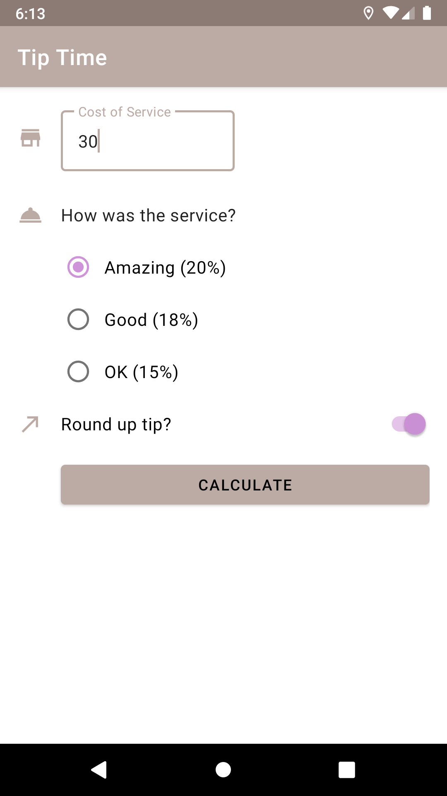
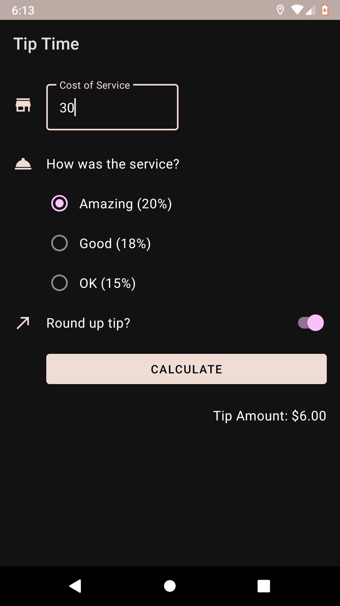

# Get user input in an app

完成 Codelab - [Get user input in an app: Part 1](https://developer.android.com/courses/pathways/android-basics-kotlin-unit-2-pathway-1)

透過建立一個計算小費的 app 來學習如何取得使用者輸入內容。

完成 Codelab - [Get user input in an app: Part 2](https://developer.android.com/courses/pathways/android-basics-kotlin-unit-2-pathway-2)

增加視覺效果，提升使用者體驗。

## Light Theme

## Dark Theme

